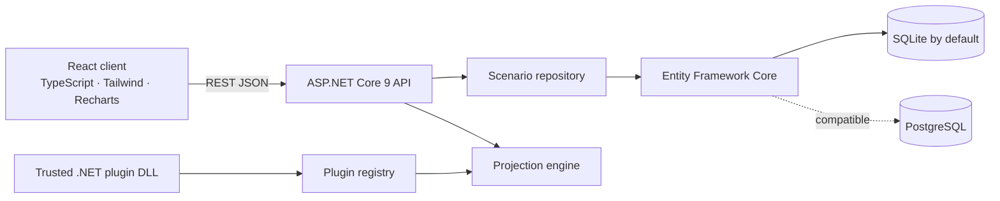
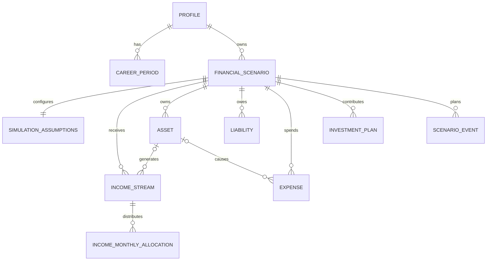
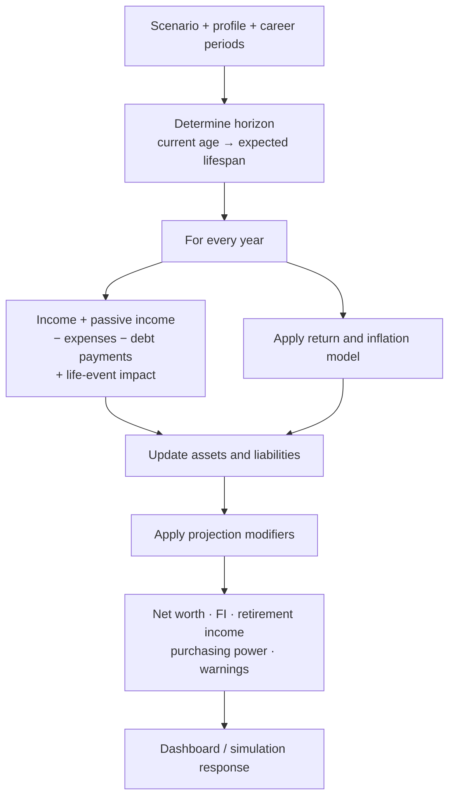

# Architecture

## Design goals

LifeLedger keeps a user’s financial data in their chosen database and keeps financial calculations independent of HTTP and persistence concerns. A projection is reproducible: it starts from a scenario snapshot, applies the same assumptions and produces the same deterministic result.

## Domain model

`FinancialScenario.ParentScenarioId` records a branch source. Scenario cloning copies the balance sheet, cash flows, assumptions and events at the time it is created, so a branch can be changed without affecting the baseline.

## Projection flow

### Simulation modes

| Mode | Return behavior | Use |
| --- | --- | --- |
| Deterministic | Weighted expected portfolio return | A clear base-case plan |
| Historical | Transparent representative return/inflation cycle | Sequence-of-returns sensitivity exploration |
| Monte Carlo | Normal sampling around weighted expected return and volatility | Likelihood of remaining solvent across many paths |

Monte Carlo’s `probabilityOfSuccess` is the share of paths that do not dip below zero net worth over the horizon. It is a model output, not a guarantee.

### Important assumptions

- Expenses marked `IndexedToInflation` compound at the scenario inflation rate.
- Income streams compound at their own annual growth rate. `IIncomeScheduleService` converts monthly, annual and seasonal declarations into each projected month's cash flow.
- Seasonal percentages are normalised, so they change timing without changing the declared annual total.
- Salaries stop at the scenario retirement age; other income streams use their defined start/end dates.
- Career-period pension estimates are added together once retirement starts. This supports a person who worked in Belgium, France, Poland, Germany, the Netherlands or elsewhere without falsely merging country systems.
- Entries retain their own currency and are consolidated through locally cached exchange rates into the profile's base currency.

## Modularity boundaries

| Boundary | Responsibility | Must not know about |
| --- | --- | --- |
| `Domain` | Financial entities and categories | EF, HTTP, UI |
| `Data` | Entity mappings, SQLite/PostgreSQL storage | Projection formulas |
| `Services` | Projection and country catalog | Request routing |
| `Plugins` | Trusted optional model adjustments | UI internals |
| API composition | REST, CORS, startup and DI | Calculation implementation detail |
| React client | Presentation and data entry | Database provider |

## Extension API

An `ILifeLedgerPlugin` can register `IProjectionModifier` implementations through `PluginContext`. The plugin receives the scenario, annual index, date, age and effective inflation, then may add an annual income delta, expense delta or net-worth delta. This is suitable for tax, country pension, grant or other rules. New first-party plugin interfaces should be additive and versioned.

Plugins are discovered from `Plugins:Directory` at startup. They are loaded in-process: only install assemblies you trust.

## Persistence and privacy

SQLite is a single local file at `data/lifeledger.db` by default. SQLite has no listening network port. PostgreSQL is supported when a self-hosted deployment needs concurrent access. Data export/import is JSON so a user can back up their model without a proprietary format.

LifeLedger runs without an outbound network dependency. Explicit currency or market-data refreshes may contact the configured public provider without sending the user's portfolio. CORS permits only the local Vite development origins by default; the compiled client is served same-origin and does not need CORS. Add trusted domains under `Cors:AllowedOrigins` before serving a separate frontend origin.
